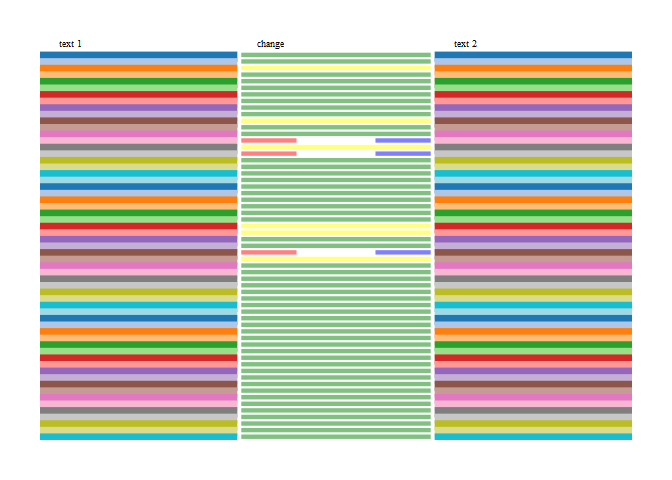
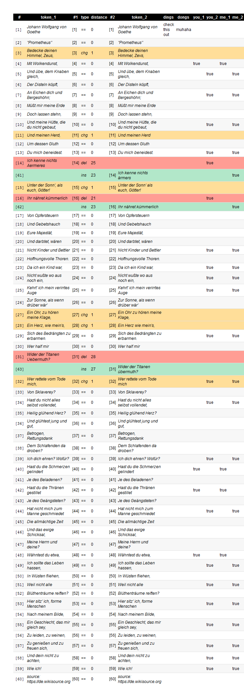

Visualization for 'diffrprojects'
=================================

<br><br> **Status**

[](https://travis-ci.org/petermeissner/diffrprojectswidget) [](https://codecov.io/gh/petermeissner/diffrprojectswidget/tree/master/R) [](https://cran.r-project.org/package=diffrprojectswidget)

*R code:* 310<br> *C++ code:* 0<br> *test code:* 0

<br><br> **Version**

0.1.4.90000

<br><br> **Description**

Interactive visualizations and tabulations for diffrprojects. All presentations are based on the htmlwidgets framework allowing for interactivity via HTML and Javascript, Rstudio viewer integration, RMarkdown integration, as well as Shiny compatibility.

<br><br> **Funding**

This software was created as part of the "Institutional Design in Western European Democracies" research project, funded by [DFG (Deutsche Forschungsgemeinschaft)](http://gepris.dfg.de/gepris/projekt/146229116), lead by [Ulrich Sieberer](https://scholar.google.com/citations?user=Q_ImhbkAAAAJ) and based at [University Konstanz](https://www.uni-konstanz.de/).

<br><br> **License**

MIT + file LICENSE <br>Peter Meissner <retep.meissner@gmail.com> \[aut, cre\] Ulrich Sieberer <ulrich.sieberer@uni-bamberg.de> \[cph\] University of Konstanz <willkommen@uni-konstanz.de> \[cph\]

<br><br> **Citation**

To cite package 'diffrprojectswidget' in publications use:

Peter Meissner (2016). diffrprojectswidget: Visualization for 'diffrprojects'. R package version 0.1.4.90000. <https://github.com/petermeissner/diffrprojects>

A BibTeX entry for LaTeX users is

@Manual{, title = {diffrprojectswidget: Visualization for 'diffrprojects'}, author = {Peter Meissner}, year = {2016}, note = {R package version 0.1.4.90000}, url = {<https://github.com/petermeissner/diffrprojects>}, }

<br><br> **BibTex for citing**

``` r
toBibtex(citation("diffrprojectswidget"))
```

<br><br> **Installation**

``` r
devtools::install_github("petermeissner/stringb")
devtools::install_github("petermeissner/rtext")
devtools::install_github("petermeissner/diffrprojects")
devtools::install_github("petermeissner/diffrprojectswidget")
```

... or, alternatively from my private R package repository ...

``` r
options( "repos" = 
  c(
    options("repos")$repos, 
    petermeissner="https://petermeissner.github.io/drat"
  ) 
)
install.packages("diffrprojectswidget")
```

<br><br> **Example usage**

``` r
library(diffrprojects)
library(diffrprojectswidget)

dp <-
  diffrproject$new()$
  text_add(list(text_version_1, text_version_2))$
  text_link()$
  text_align( maxDist = 1 )

dp$text_code_regex(
  text    = 1, 
  x       = "change",    
  pattern = "change", 
  val     = "change"
)
dp$text_code_regex(
  text    = 1, 
  x       = "change",    
  pattern = "add", 
  val     = "add"
)
dp$text_code_regex(
  text    = 1, 
  x       = "change",    
  pattern = "modif", 
  val     = "modif"
)
dp$text_code_regex(
  text    = 1, 
  x       = "change",    
  pattern = "delete", 
  val     = "delete"
)
dp$text_code_regex(text=1, x="stability", pattern="same", val=TRUE)

dp$alignment_code(1, sample(1:6)*2,"alignment_code", TRUE)
```

``` r
dpv <- dp_vis(dp, 1, align_var = TRUE, text_var = TRUE)
dpv
```



``` r
dpt <- dp_table(dp, 1, align_var = TRUE, text_var = TRUE)
dpt
```


